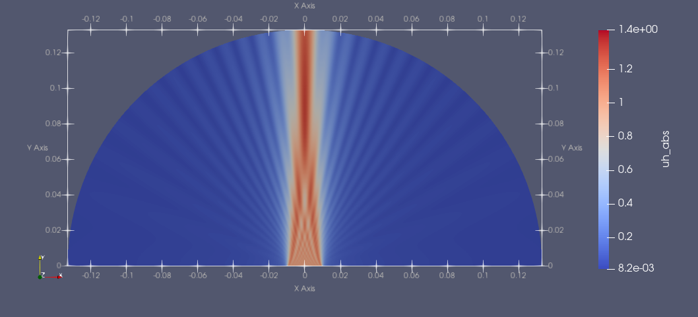

# HelmholtzEquation Code

**HelmholtzEquation** is a FEM code implemented in [Julia](https://julialang.org/) language to compute the pressure field of a $2D$ Helmholtz problem with mixed boundary conditions.

Helmholtz equation:

<p id="Heq">

$$
\left. -\triangle \ u(x,y) - k^2\ u(x,y)=0 \ \ \ \ (1) \right.
$$

</p>
results from applying the technique of separation of variables to the wave propagation equation in homogeneous media

<p id="wave">

$$
\left.\frac{\partial^2 U(x,y,t)}{\partial t^2} = c^2 \ \triangle \ U(x,y,t) \ \ \ \ (2) \right.
$$

</p>

if one seeks solutions  of the form $\left. U(x,y,t) =  \ u(x,y) \ e^{- i \omega \ t} \right.$, since then the spatial part of $\left. U(x,y,t) \right.$, $\left. u(x,y) \right.$, satisfies (<a href="#Heq">1</a>). Here $\omega$ is the $\it angular$ $\it frequency$, $c$ is the speed of sound, $\lambda$ is the wave length and $\left. k= \omega/c \ =2\ \pi/\lambda \right.$  is the number of waves per unit of distance, called $\it wavenumber$.

Under the assumption that the acoustic wave propagation is linear and also that the amplitude of shear waves in the media are much smaller than the amplitude of the pressure waves, nonlinear effects and shear waves may be neglected.

In **HelmholtzEquation** code we consider a simpler $2D$ plane strain model in the $x - y$ plane. The physical $2D$ domain is the semicircle of radius $r$ and center on the origin of coordinates, $\Omega = \{(x, y), y > 0,\ x^2 +y^2 < r^2\}$. Moreover, we assume that a transducer of width $2a$, with $\left. 0 < a < r \right.$, and flat geometry is located at the origin, see the <a href="#geometry">Figure 1</a>. The transducer emits a pulse of high frequency $f$, with amplitude equal to $C > 0$. 

We consider the following  $\it radiation$ $\it problem$ 

$$
\left. -\triangle u(x,y) - k^2u(x,y)=0, \ \ \ (x,y)\in \Omega \right.
$$

with $\it mixed$ boundary conditions


$$
\left. u(x,y)= C\ \ \  on \ \ \ \ \ \  \Gamma_D \right.
$$

$$
\left. \frac{\partial u(x,y)}{\partial \overrightarrow{n}} = 0 \ \ \  on \ \ \ \ \ \  \Gamma_N \right.
$$

$$
\left. \frac{\partial u(x,y)}{\partial \overrightarrow{n}}+ \textrm{i}\  k u(x,y)=0 \ \ \  on \ \ \ \ \ \  \Gamma_R  \right.
$$

where $\left. \Gamma_D= \{(x,0), \  |x| \leq a \ \} \right.$ represents the transducer, on $\left. \Gamma_N= \{ (x,0), \  r \geq |x| >a \  \} \right.$ is simulated an acoustically rigid wall,   $\left. \Gamma_R= \{(x,y), \  y>0, x^2+y^2=r^2 \ \} \right.$ corresponds to a non-reflecting boundary, $\textrm{i}$ denotes the imaginary unit and $\overrightarrow{n}$ denotes the normal vector to the boundaries $\Gamma_N$ or $\Gamma_R$. In consequence, the acoustic wave pressure $\left. u(x, y) \right.$ is a complex valued function solution of the Helmholtz equation.
 

The constant wavenumber $k$ is computed as

$$
\left. k=\frac{2\pi\ f}{c} \right.
$$

where $c$ is the ultrasound speed propagation and $f$ frequency of the pulse emitted by the transducer.

<p align=center>
<a href="./graphic/geometry.png">

</a>
</img>

**Figure 1:** Physical domain $\Omega$ and boundaries $\Gamma_D$, $\Gamma_N$ and $\Gamma_R$.
</p>

We implemented an in-house code in [Julia](https://julialang.org/) language to solve the $\it radiation$ $\it problem$ with FEM quadrilateral cubic Lagrange basis functions. The system of linear equations derived from FEM discretization of the $\it radiation$ $\it problem$ is solved using GMRES with Complex Shifted Laplacian as preconditioner [^1].

We use the [Gmsh](https://gmsh.info/) mesh generator to construct the structured quadrilateral mesh. To generate the mesh partition shown in <a href=#mesh_geometry>Figure 2</a>, $n$ points in the $X$ direction and $m$ points in the $Y$ direction were assigned.

<p align=center id=mesh_geometry>
<a href="./graphic/mesh_geometry.png">

</img>
</a>

**Figure 2:** Mesh generated with Gmsh, for $\left. n= 30 \right.$ and $m= 15$.
</p>

## Requirements
**HelmholtzEquation Code** has been tested with **Julia 1.6.5** and above and should run on most personal laptops and desktop computers.

**Packages**
- [Gmsh](https://github.com/JuliaFEM/Gmsh.jl)
- [GeometryBasics](https://docs.juliahub.com/GeometryBasics/lB452/0.3.0/)
- [Gridap](https://juliapackages.com/p/gridap)
- [GridapGmsh](https://github.com/gridap/GridapGmsh.jl)
- [Gridap.Algebra](https://gridap.github.io/Gridap.jl/stable/Algebra/#Gridap.Algebra)
- [Gridap.FESpaces](https://gridap.github.io/Gridap.jl/stable/FESpaces/#Gridap.FESpaces)
- [Gridap.ReferenceFEs](https://gridap.github.io/Gridap.jl/stable/ReferenceFEs/#Gridap.ReferenceFEs)
- [Gridap.Arrays](https://gridap.github.io/Gridap.jl/stable/Arrays/#Gridap.Arrays)
- [Gridap.Geometry](https://gridap.github.io/Gridap.jl/stable/Geometry/#Gridap.Geometry)
- [Gridap.Fields](https://gridap.github.io/Gridap.jl/stable/Fields/#Gridap.Fields)
- [Gridap.CellData](https://gridap.github.io/Gridap.jl/stable/CellData/#Gridap.CellData)
- [IterativeSolvers](https://juliapackages.com/p/iterativesolvers)
- [IncompleteLU](https://github.com/haampie/IncompleteLU.jl)
- [SparseArrays](https://docs.julialang.org/en/v1/stdlib/SparseArrays/)
- [BenchmarkTools](https://juliaci.github.io/BenchmarkTools.jl/stable/) 
- [Plots]()
- [CPUTime](https://juliapackages.com/p/cputime)

Add the necessary Julia packages to run our main code:
``` Julia
(v1.6.5) pkg> add Gmsh GeometryBasics Gridap GridapGmsh IterativeSolvers IncompleteLU SparseArrays BenchmarkTools Plots CPUTime
```

## Input
- frequency $f$ (Hz). Use a frequency value in the interval $\left. [0.25 , 2]\times 10^6 \right.$ Hz.  
- Radius $r$ of semicircle.
- Transducer semiaperture $a$.
- Mesh partition $n$ in $X$ direction and $m$ in $Y$ direction.

## Graphical Output
For the following parameters $\left. f=1\times10^6 \right.$ Hz, $\left. r= 0.133 \right.$ m, $\left. a=0.01 \right.$ m, $\left. n=476 \right.$ and $\left. m=238 \right.$ (mesh size $\left. h=\lambda/2.48=6.05\cdot 10^{-4} \right.$), the results graphed in <a href="#abs_u_xy" >Figure 3</a> and <a href="#abs_u_0y" >Figure 4</a> were obtained. By default the code uses a pulse of constant amplitude $\left. C=1 \right.$ and the ultrasound speed propagation is constant $c=1500$ m/s.

For these images we used the [ParaView](https://www.paraview.org/) software.

<p align=center id=abs_u_xy>
<a href="./graphic/f1mhzlambdaentre2c48.png">

</img>
</a>

**Figure 3:** Absolute value of the FEM solution, $|u(x,y)|$.
</p>


<p align=center id="abs_u_0y">
<a href="./graphic/linef1mhzlambdaentre2c48.png">

</img>
</a>

**Figure 4:** Absolute value of the FEM solution on the line $X=0$, $|u(0,y)|$.
</p>

## Note
To execute the code the `mesh_geometry.jl`, `solve_Helmholtz.jl` and `main.jl` files must be in the same folder. Run the `main.jl` file with Julia language.
```
julia main.jl
```

## Authors
*Manuel Cruz Rodriguez*, *Ahmed Mansur Graverán*, *Victoria Hernández Mederos*, *Jorge Estrada Sarlabous*, *Eduardo Moreno Hernández*

[**Institute of Cybernetics, Mathematics and Physics; Havana, Cuba**](http://www.icimaf.cu)

##Acknowledgments

Special thanks to [Domenico Lahaye](https://www.tudelft.nl/ewi/over-de-faculteit/afdelingen/applied-mathematics/lahaye-djp?0%5BL%5D=&cHash=8a49b66cff8f5d09cf02337a0f9638b4), DIAM Delft University, for his advices concerning Julia language as well as the use of Complex Shifted Laplacian Preconditioner. 


## Bibliography
[^1]: Y.A. Erlangga, C. Vuik, C.W. Oosterlee, On a class of preconditioners for solving the Helmholtz equation Appl. Numer. Math. 50 (3–4) (2004) 409–425.
